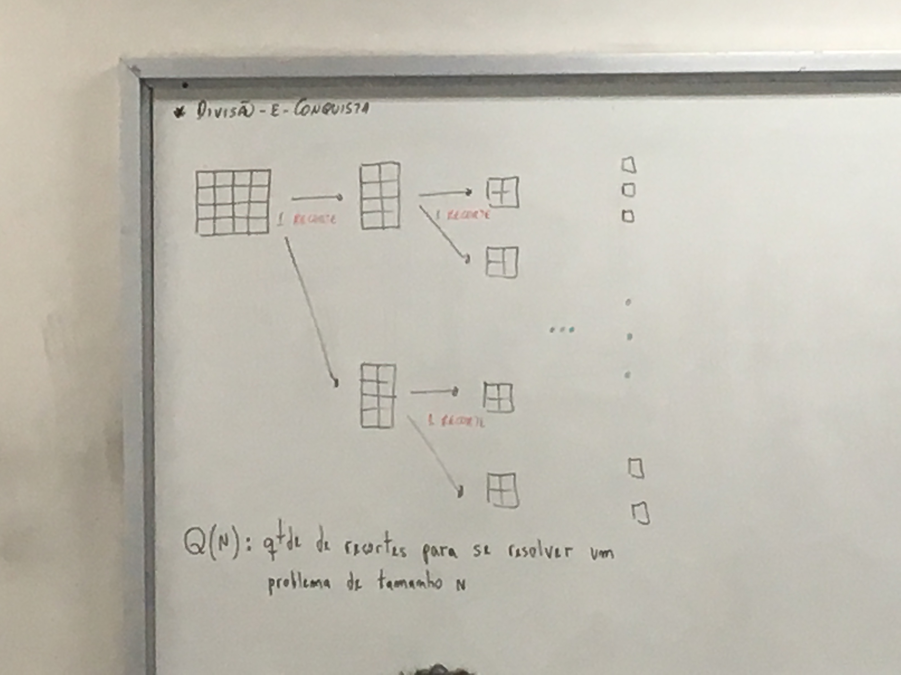
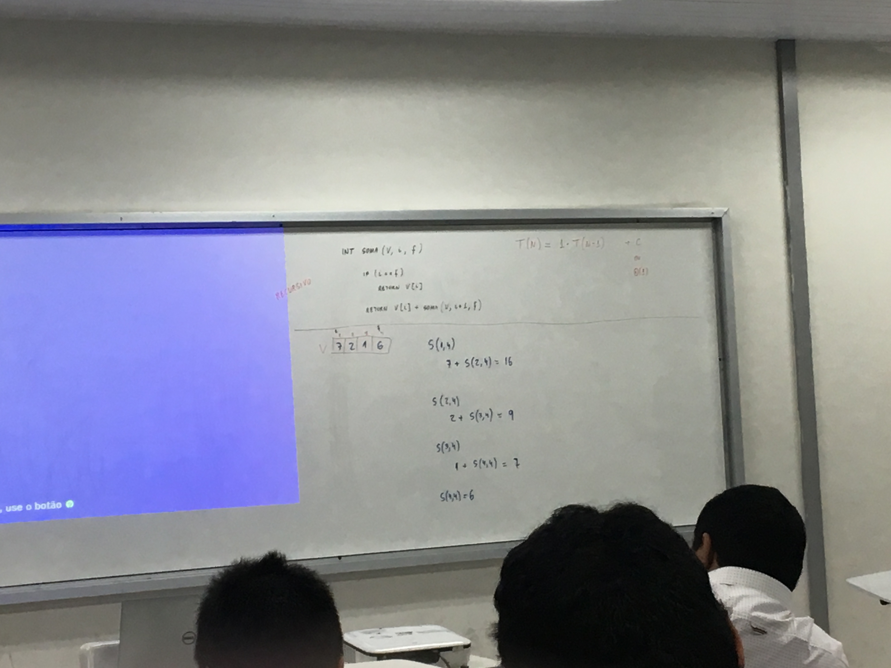

## Explicação da Aula 4
##### Segunda-Feira 19/08/2019

---

> Divisão e Conquista:

* Imagem:


> Nota:
Q(N): quantidade de recortes se resolve um problema de tamanho "N".


| Descrição | Quantidade |
| --------- | ---------- |
| Q(1)      | 0          |
| Q(2)      | 1          |
| Q(4)      | 3          |
| Q(8)      | 7          |
| Q(16)     | 15         |

* Função Recursiva:


$Q(N) = 2Q (\frac{n}{2}) +1$ > Equação de Recorencia.

Q: quantidade de recortes para se resolver um problema de tamanho $\frac{n}{2}$

* Função:

$Q(4) = 2Q (\frac{4}{2}) +1 = 3$

* Função:

$Q(2) = 2Q (\frac{2}{2}) +1 = 1$

* Função:

$Q(1) = 0$




> Algoritmos:

```
INT soma(V, i, f)
  if(i == f)
    return V[i]
  return V[i] + soma(V, i, f)
```
> Aplicação do algoritmo:

T(N) => Tempo de constate

$T(N) = 1 * T(N - 1)$    => +c || $\Theta(1)$

> Exemplo:

Soma:

|     |     |     |     |
| --- | --- | --- | --- |
| 7   | 2   | 1   | 6   |
|     |     |     |     |

$$
  S(1, 4)
    7 + 5(2, 4) = 16

  S(2, 4)
    2 + 5(7, 4) = 9

  S(3, 4)
    1 + 5(4, 7) = 7

  S(1, 4)
    = 6
$$

Soma 2 Recursivo:

|     |     |     |     |
| --- | --- | --- | --- |
| 7   | 2   | 1   | 6   |
|     |     |     |     |

$T(N) = 2T (\frac{n}{2}) + C$

---

$$
  S(1, 4)
    S(1, 2) + s(3x4) = 16

  S(1, 2)
    S(1, 1) + s(2x2) = 9

  S(7, 1) = 7

  S(1,1) =2

$$


> Merge Sort: Ordenaça por intercalação:

Merge-Sorte(A, p, r)
```pseudo-codigo
  if P < 1
  then q <- []
  <!-- FIXME: ALGORITMO DO SLIDE -->
```
