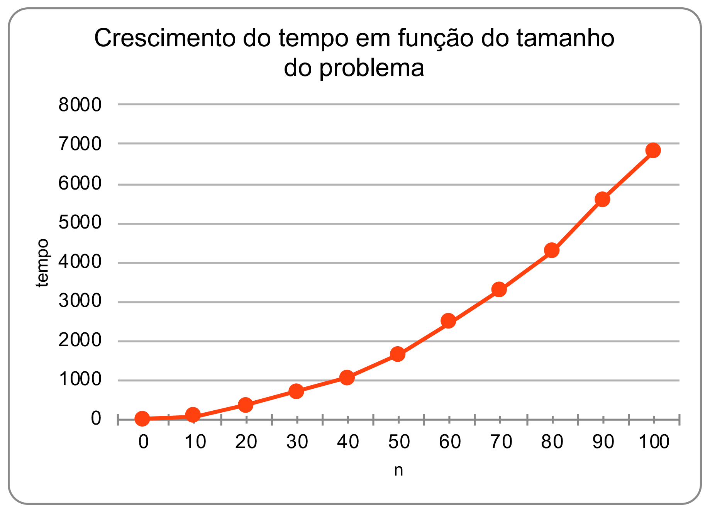
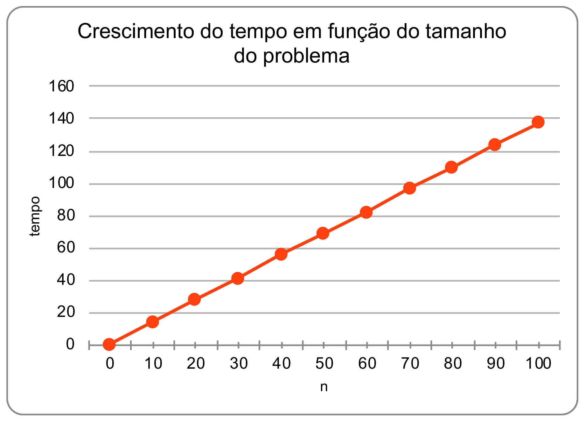
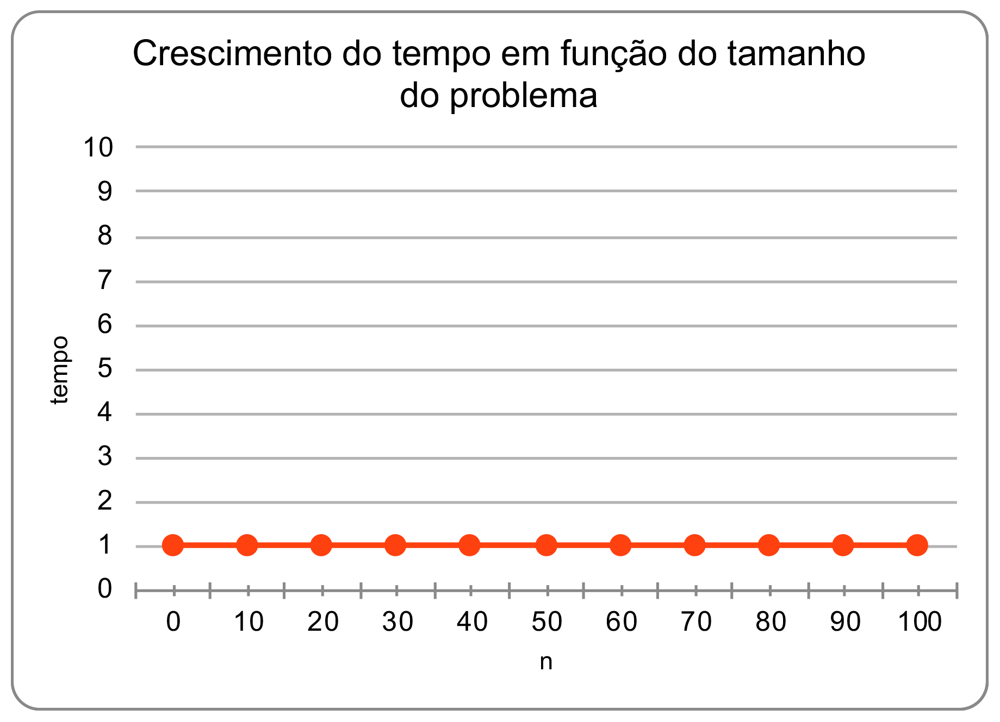

## N584 – Projeto e Análise de Algoritmos
#### Prof. Napoleão Nepomuceno
#### AV1 - Lab02
##### Data do Laboratório: 14/08/2019
##### Data da Entrega: 18/08/2019 (enviar arquivos .odt e .ods)

---

### Exercício 1

Passo 1: Implementar o seguinte código em Java ou equivalente em outra linguagem de programação.

```java
import java.util.concurrent.TimeUnit;
public class Exercicio1 {
	public static void main(String[] args) {
		System.out.printf("Soma 1\n");
		System.out.printf("%10s%20s%10s\n","n", "solucao", "tempo");
		for (int n = 0; n <= 100; n+=10) {
			soma1(n);
		}
		System.out.printf("Soma 2\n");
		System.out.printf("%10s%20s%10s\n","n", "solucao", "tempo");
		for (int n = 0; n <= 100; n+=10) {
			soma2(n);
		}
		System.out.printf("Soma 3\n");
		System.out.printf("%10s%20s%10s\n","n", "solucao", "tempo");
		for (int n = 0; n <= 100; n+=10) {
			soma3(n);
		}
	}
	static void soma1 (long n) {
		double inicio = System.currentTimeMillis();
		long soma = 0;
		for (long i = 1; i <= n; i++) {
			long termo = 0;
			for (long j = 1; j <= i; j++) {
				try {
					TimeUnit.MILLISECONDS.sleep(1);
				} catch (InterruptedException e) {
					e.printStackTrace();
				}
				termo = termo + j;
			}
			soma = soma + termo;
		}
		double fim = System.currentTimeMillis();
		double tempo = fim - inicio;
		System.out.printf("%10d%20d%10.0f\n", n, soma, tempo);
	}
	static void soma2 (long n) {
		double inicio = System.currentTimeMillis();
		long soma = 0;
		for (long i = 1; i <= n; i++) {
			long termo = ((1 + i) * i) / 2;
			try {
				TimeUnit.MILLISECONDS.sleep(1);
			} catch (InterruptedException e) {
				e.printStackTrace();
			}
			soma = soma + termo;
		}
		double fim = System.currentTimeMillis();
		double tempo = fim - inicio;
		System.out.printf("%10d%20d%10.0f\n", n, soma, tempo);
	}
	static void soma3 (long n) {
		double inicio = System.currentTimeMillis();
		try {
			TimeUnit.MILLISECONDS.sleep(1);
		} catch (InterruptedException e) {
			e.printStackTrace();
		}
		long soma = n * (n+1) * (n+2) / 6;
		double fim = System.currentTimeMillis();
		double tempo = fim - inicio;
		System.out.printf("%10d%20d%10.0f\n", n, soma, tempo);
	}
}
```

* Passo 2: Executar o código e preencher o resultado na planilha disponibilizada. Obs.: este passo deve ser realizado obrigatoriamente no laboratório. (10%)

**Nota:** o link do arquivo para gera a [planilha](./AV1-Lab02.ods)

> Resultado:

Saida da função Soma 1:

| n    | solução | tempo |
| :--- | :-----: | ----: |
| 0    |    0    |     0 |
| 10   |   220   |    80 |
| 20   |  1540   |   357 |
| 30   |  4960   |   712 |
| 40   |  11480  |  1044 |
| 50   |  22100  |  1644 |
| 60   |  37820  |  2469 |
| 70   |  59640  |  3305 |
| 80   |  88560  |  4282 |
| 90   | 125580  |  5586 |
| 100  | 171700  |  6817 |

Gráfico da função soma 1:



Função **Quadratica**.

---

Saída da função Soma 2:

| n    | solução | tempo |
| :--- | :-----: | ----: |
| 0    |    0    |     0 |
| 10   |   220   |    14 |
| 20   |  1540   |    28 |
| 30   |  4960   |    41 |
| 40   |  11480  |    56 |
| 50   |  22100  |    69 |
| 60   |  37820  |    82 |
| 70   |  59640  |    97 |
| 80   |  88560  |   110 |
| 90   | 125580  |   124 |
| 100  | 171700  |   137 |



Função **Linear**.

---

Saída da função Soma 3:

| n    | solução | tempo |
| :--- | :-----: | ----: |
| 0    |    0    |     1 |
| 10   |   220   |     1 |
| 20   |  1540   |     1 |
| 30   |  4960   |     1 |
| 40   |  11480  |     1 |
| 50   |  22100  |     1 |
| 60   |  37820  |     1 |
| 70   |  59640  |     1 |
| 80   |  88560  |     1 |
| 90   | 125580  |     1 |
| 100  | 171700  |     1 |



Função **Constante**.

---

* Passo 3: Realizar a análise de complexidade para cada um dos métodos. Desconsiderar na análise as instruções do try catch (utilizadas apenas para simular uma máquina mais lenta) e as de rastreamento do tempo de execução. As curvas obtidas na planilha estão de acordo com a complexidade de cada um dos métodos? Obs.: este passo deve ser realizado obrigatoriamente no laboratório. (30%)

> Resultado:

Analise de complexidade função soma 1:

```java

1 static void soma1 (long n) {                                      custo     vezes
2  double inicio = System.currentTimeMillis();                       c1         1*
3  long soma = 0;                                                    c2         1
4  for (long i = 1; i <= n; i++) {                                   c3      (n + 1)
5  	long termo = 0;                                                  c4        (n)
6  	for (long j = 1; j <= i; j++) {                                  c5      [(2 + (n + 1)) * n] / 2 || n^2
7  		try {                                                          c6        *
8  			TimeUnit.MILLISECONDS.sleep(1);                              c7        *
9  		} catch (InterruptedException e) {                             c8        *
10  			e.printStackTrace();                                       c9        *
11  		}                                                            c10       *
12  		termo = termo + j;                                           c11      [(1 + n) * n) / 2]
13  	}                                                              c12        *
14  	soma = soma + termo;                                           c13       (n)
15  }                                                                c14
16  double fim = System.currentTimeMillis();                         c15        1*
17  double tempo = fim - inicio;                                     c16        1*
18  System.out.printf("%10d%20d%10.0f\n", n, soma, tempo);           c17        1*
19}                                                                  c18
```

Analise de complexidade da função soma 1: $\Theta(n^2)$

---

Analise de complexidade função soma 2:

```java

1 static void soma2 (long n) {                                        custo     vezes
2  double inicio = System.currentTimeMillis();                        c1         1*
3  long soma = 0;                                                     c2         1*
4	for (long i = 1; i <= n; i++) {                                     c3         (n + 1)
5		long termo = ((1 + i) * i) / 2;                                   c4         (n)
6		try {                                                             c5         *
7			TimeUnit.MILLISECONDS.sleep(1);                                 c6         *
8		} catch (InterruptedException e) {                                c7         *
9			e.printStackTrace();                                            c8         *
10		}                                                               c9         *
11		soma = soma + termo;                                            c10        (n)
12	}                                                                 c11        *
13	double fim = System.currentTimeMillis();                          c12        1*
14	double tempo = fim - inicio;                                      c13        1*
15	System.out.printf("%10d%20d%10.0f\n", n, soma, tempo);            c14        1*
16}

Analise de complexidade da função soma 1: $\Theta(n)$ ou seja **linear**

---

Analise de complexidade função soma 3:

```java
1 static void soma3 (long n) {                                     custo       vezes
2  double inicio = System.currentTimeMillis();                     c1          1*
3  try {                                                           c2          1*
4  	TimeUnit.MILLISECONDS.sleep(1);                                c3          1*
5  } catch (InterruptedException e) {                              c4          1*
6  	e.printStackTrace();                                           c5          1*
7  }                                                               c6          1*
8  long soma = n * (n+1) * (n+2) / 6;                              c7          1
9  double fim = System.currentTimeMillis();                        c8          1*
10  double tempo = fim - inicio;                                   c9          1*
11  System.out.printf("%10d%20d%10.0f\n", n, soma, tempo);         c10         1*
12}                                                                c11         1*
```

Analise de complexidade da função soma 1: $\Theta(1)$ ou seja **constante**

---

### Exercício 2.2

* Passo 1: Implementar o seguinte código em Java ou equivalente em outra linguagem de programação.

```java
import java.util.Random;
import java.util.concurrent.TimeUnit;

public class Exercicio2{
	public static void main(String[] args) {
		int n = 1000;
		int[] A;
		A = criaVetorAleatorio(n);
		double inicio, fim, tempo;
		inicio = System.currentTimeMillis();
		metodo(A, n);
		fim = System.currentTimeMillis();
		tempo = fim - inicio;
		System.out.printf("Tempo: %1.0f", tempo);
	}

	static double metodo (int[] vetor, int n) {
		double v = 1;
		for (int i = 0; i < n; i++) {
			try {
				TimeUnit.MILLISECONDS.sleep(1);
			} catch (InterruptedException e) {
				e.printStackTrace();
			}
			v = v * vetor[i];
			if (v == 0) {
				return 0;
			}
		}
		return v;
	}

	static int[] criaVetorAleatorio (int n) {
		Random randomGenerator = new Random();
		int[] A = new int[n];
		for (int i = 0; i < n; i++) {
			A[i] = randomGenerator.nextInt(100);
		}
		return A;
	}
}

```

* Passo 2: O que exatamente a função metodo está computando? (10%)

> Resultado:

Multiplicando os elementos do vetor.

---

* Passo 3: Executar o código 10 vezes e copiar a saída de cada execução do programa aqui abaixo. Visto que o tamanho do problema não se modifica, o que justifica a grande variação do tempo de uma execução para outra? (20%)

> Resultado:

| execução |  resultado  |
| :------- | :---------: |
| 1        | Tempo: 211  |
| 2        |  Tempo: 28  |
| 3        |  Tempo: 50  |
| 4        |  Tempo: 69  |
| 5        | Tempo: 1274 |
| 6        |  Tempo: 1   |
| 7        |  Tempo: 55  |
| 8        |  Tempo: 57  |
| 9        | Tempo: 158  |
| 10       |  Tempo: 60  |

A variação de tempo de uma execursão para outra se dar devido a outros processos na máquina.

---

* Passo 4: Realizar a análise de complexidade de melhor e pior casos para o método. Obs.: Desconsiderar na análise as instruções do try catch (utilizadas apenas para simular uma máquina mais lenta) e as de rastreamento do tempo de execução. (20%)
<!-- TODO: Respota dúvidas em sala com o professor -->
> Resultado:

---

* Passo 5: Se o vetor A, ao invés de 1000 elementos, tivesse 1.000.000 elementos, sua complexidade de tempo aumentaria? (10%)
<!-- TODO: Respota dúvidas em sala com o professor -->
> Resultado:

[voltar](../../../README.md)
