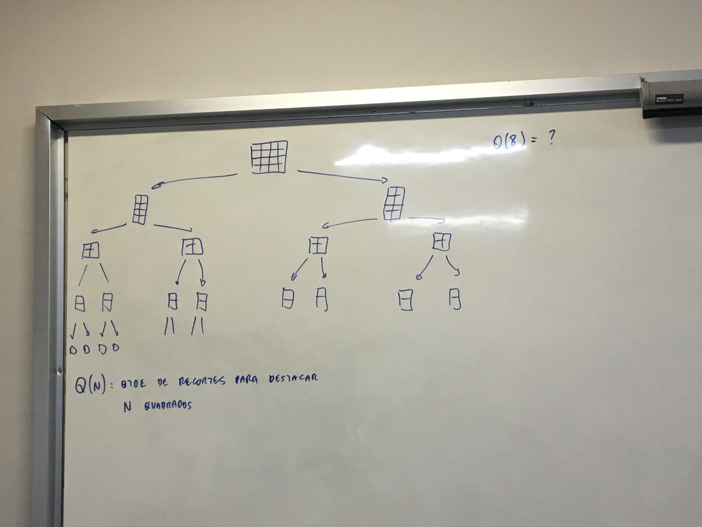
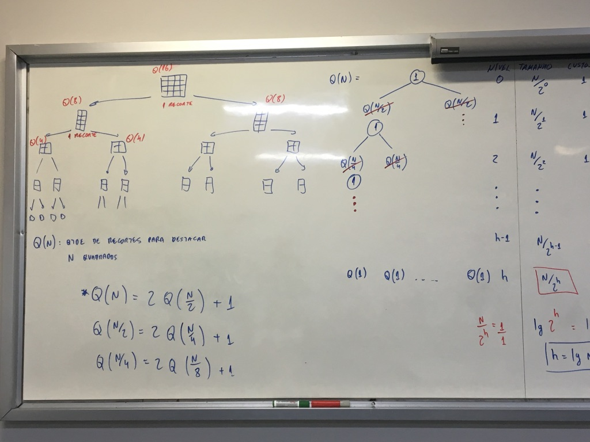
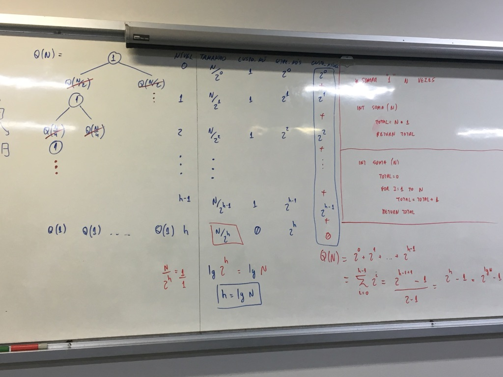

## N584 – Projeto e Análise de Algoritmos
### Prof. Napoleão Nepomuceno
#### AV1 - Lab03 - Notas de Aula
##### Data do Laboratório: 21/08/2019

---

* Imagem:


Q(N): Quantidade de recortes para destacar N quadros

    > Equação de recorência:

\(Q(n) = 2 Q(\frac{n}{2}) + 1\)

\(Q(\frac{n}{2}) = 2 Q(\frac{n}4) + 1\)

\(Q(\frac{n}{4}) = 2 Q(\frac{n}8) + 1\)



> Tabela pra calcula:

| nivel |        tamanho        |  custo nó   |     nivel     |              tamanho              |
| :---- | :-------------------: | :---------: | :-----------: | :-------------------------------: |
| 0     |   \(\frac{n}{2^0}\)   |      c      |       1       |              \(2^0\)              |
| 1     |   \(\frac{n}{2^1}\)   |      c      |       1       |              \(2^1\)              |
| 2     |   \(\frac{n}{2^2}\)   |      c      |       1       |              \(2^2\)              |
| 3     |   \(\frac{n}{2^3}\)   |      c      |       1       |              \(2^3\)              |
| ****  |         ****          |    ****     |     ****      |               ****                |
| ****  |         ****          |    ****     |     ****      |               ****                |
| h-1   | \(\frac{n}{2^{h-1}}\) |      c      |       1       |           \(2^{(h-1)}\)           |
| h     |   \(\frac{n}{2^h}\)   | \(2^h\) = n | \(\Theta(1)\) | \(\Theta(2^4)\) = \(\Theta(2^n)\) |

> O Valor de T(N) e o somatorio da coluna tamanho: //TODO: Formula no caderno



> Teste de Algoritmos Interativos:

```
Somar "1" n vezes       tempo     #vezes      T(n) = \tetra(1)
int soma(n)               c1        1
  total = n + 1           c2        1           T(n) = c1 + c2
  return total
```

* Classe de complexidade

Constante ou \(\Theta(1)\)

```
int soma(n)                 tempo     #vezes      T(n) = \tetra(1)
  total = 0                   c1         1
  for i = 0 to N              c2        n+1
    total = total + 1         c3         n
  return total                c4         1       T(n) = $\Theta(n)$
```

* Classe de complexidade

Linear ou \(\Theta(N)\)

> Teste de Algoritmos Recursivos:

```
int soma(n)               tempo     #vezes      T(n) = \tetra(1)
  if(n == 1)
    return 1
  a = soma(n/2)
  b = soma(n/2)
  return a + b + n%2
```

* Classe de complexidade

Linear ou \(\Theta(N)\)

```algoritmo
int soma(n)
  if(n == 1)
    return 1
  return 2 * soma(n / 2) + n%2
```

* Classe de complexidade

Linear ou $\Theta(N)$


[voltar](../../../README.md)
