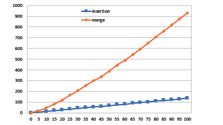
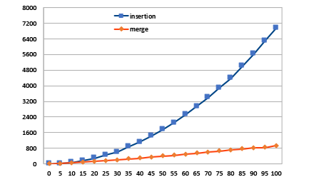

## N584 – Projeto e Análise de Algoritmos
### Prof. Napoleão Nepomuceno
#### AV1 - Lab03
##### Data do Laboratório: 21/08/2019

> Entrega do trabalho:
Data da Entrega: 25/08/2019 (enviar arquivos .odt e .ods)

### Exercício 1

- **Passo 1**: Implementar o seguinte código em Java ou equivalente em outra linguagem de programação.

```java
import java.util.Random;
import java.util.concurrent.TimeUnit;

public class Exercicio1 {
	public static void main(String[] args) {
		int[] A, B;
		double inicio1, fim1, tempo1;
		double inicio2, fim2, tempo2;

		System.out.println("Ordenado crescente");
		System.out.printf("%5s%10s%10s\n","n", "insertion", "merge");
		System.out.println("-------------------------");
		for (int n = 0; n <= 100; n+=5) {
			A = criaVetorCrescente(n);
			B = A.clone();
			inicio1 = System.currentTimeMillis();
			A = insertionSort(A);
			fim1 = System.currentTimeMillis();
			tempo1 = fim1 - inicio1;
			inicio2 = System.currentTimeMillis();
			B = mergeSort(B, 0, n-1);
			fim2 = System.currentTimeMillis();
			tempo2 = fim2 - inicio2;
			System.out.printf("%5d%10.0f%10.0f\n", n, tempo1, tempo2);
		}

		System.out.println("Ordenado decrescente");
		System.out.printf("%5s%10s%10s\n","n", "insertion", "merge");
		System.out.println("-------------------------");
		for (int n = 0; n <= 100; n+=5) {
			A = criaVetorDecrescente(n);
			B = A.clone();
			inicio1 = System.currentTimeMillis();
			A = insertionSort(A);
			fim1 = System.currentTimeMillis();
			tempo1 = fim1 - inicio1;
			inicio2 = System.currentTimeMillis();
			B = mergeSort(B, 0, n-1);
			fim2 = System.currentTimeMillis();
			tempo2 = fim2 - inicio2;
			System.out.printf("%5d%10.0f%10.0f\n", n, tempo1, tempo2);
		}

		System.out.println("Ordenado aleatório");
		System.out.printf("%5s%10s%10s\n","n", "insertion", "merge");
		System.out.println("-------------------------");
		for (int n = 0; n <= 100; n+=5) {
			A = criaVetorAleatorio(n);
			B = A.clone();
			inicio1 = System.currentTimeMillis();
			A = insertionSort(A);
			fim1 = System.currentTimeMillis();
			tempo1 = fim1 - inicio1;
			inicio2 = System.currentTimeMillis();
			B = mergeSort(B, 0, n-1);
			fim2 = System.currentTimeMillis();
			tempo2 = fim2 - inicio2;
			System.out.printf("%5d%10.0f%10.0f\n", n, tempo1, tempo2);
		}
	}

	static int[] criaVetorCrescente (int n) {
		Random randomGenerator = new Random();
		int[] A = new int[n];
		for (int i = 1; i < n; i++) {
			A[i] = A[i-1] + randomGenerator.nextInt(10);
		}
		return A;
	}

	static int[] criaVetorDecrescente (int n) {
		Random randomGenerator = new Random();
		int[] A = new int[n];
		if (n != 0) {
			A[0] = Integer.MAX_VALUE;
		}
		for (int i = 1; i < n; i++) {
			A[i]= A[i-1] - randomGenerator.nextInt(10);
		}
		return A;
	}

	static int[] criaVetorAleatorio (int n) {
		Random randomGenerator = new Random();
		int[] A = new int[n];
		for (int i = 0; i < n; i++) {
			A[i] = randomGenerator.nextInt(100*n);
		}
		return A;
	}

	static void imprimeVetor (int[] A) {
		for (int i = 0; i < A.length; i++) {
			System.out.println(A[i]);
		}
	}

	static int[] insertionSort(int[] A) {
		for (int j = 1; j < A.length; j++) {
			try {
				TimeUnit.MILLISECONDS.sleep(1);
			} catch (InterruptedException e) {
				e.printStackTrace();
			}
			int chave = A[j];
			int i = j - 1;
			while (i >= 0 && A[i] > chave) {
				try {
					TimeUnit.MILLISECONDS.sleep(1);
				} catch (InterruptedException e) {
					e.printStackTrace();
				}
				A[i+1] = A[i];
				i--;
			}
			A[i+1] = chave;
		}
		return A;
	}

	static int[] mergeSort(int[] A, int p, int r) {
		if (p < r) {
			int q = (p + r) / 2;
			mergeSort(A, p, q);
			mergeSort(A, q + 1, r);
			merge(A, p, q, r);
		}
		return A;
	}

	static void merge(int[] A, int p, int q, int r) {
		int i, j;
		int n1 = q - p + 1;
		int n2 = r - q;
		int[] L = new int[n1 + 1];
		int[] R = new int[n2 + 1];
		for (i = 0; i < n1; i++) {
			L[i] = A[p + i];
		}
		for (j = 0; j < n2; j++) {
			R[j] = A[q + j + 1];
		}
		L[n1] = Integer.MAX_VALUE;
		R[n2] = Integer.MAX_VALUE;
		i = 0;
		j = 0;
		for (int k = p; k <= r; k++) {
			try {
				TimeUnit.MILLISECONDS.sleep(1);
			} catch (InterruptedException e) {
				e.printStackTrace();
			}
			if (L[i] <= R[j]) {
				A[k] = L[i++];
			} else {
				A[k] = R[j++];
			}
		}
	}
}
```

---

- **Passo 2:** Os métodos insertionSort e mergeSort realizam a ordenação de um vetor de n elementos. No método main, esses métodos são chamados para diferentes tamanhos de vetores e diferentes ordenações prévias dos elementos do vetor de entrada (crescente, decrescente e aleatório). Executar o código e preencher o resultado na planilha disponibilizada. Obs.: este passo deve ser realizado obrigatoriamente no laboratório. (10%).

> Ordenando crescente:

| n    | insertion | merge |
| :--- | :-------: | ----: |
| 0    |     0     |     0 |
| 5    |     6     |    17 |
| 10   |    12     |    47 |
| 15   |    19     |    81 |
| 20   |    26     |   118 |
| 25   |    34     |   165 |
| 30   |    42     |   206 |
| 35   |    46     |   252 |
| 40   |    53     |   299 |
| 45   |    59     |   336 |
| 50   |    65     |   388 |
| 55   |    74     |   442 |
| 60   |    80     |   489 |
| 65   |    88     |   540 |
| 70   |    94     |   594 |
| 75   |    100    |   650 |
| 80   |    108    |   706 |
| 85   |    115    |   761 |
| 90   |    121    |   818 |
| 95   |    128    |   875 |
| 100  |    136    |   928 |

> Gráfico



> Ordenado decrescente:

| n    | insertion | merge |
| :--- | :-------: | ----: |
| 0    |     0     |     0 |
| 5    |    19     |    15 |
| 10   |    71     |    46 |
| 15   |    158    |    82 |
| 20   |    283    |   122 |
| 25   |    444    |   164 |
| 30   |    599    |   193 |
| 35   |    881    |   250 |
| 40   |   1110    |   297 |
| 45   |   1413    |   344 |
| 50   |   1749    |   393 |
| 55   |   2104    |   443 |
| 60   |   2518    |   493 |
| 65   |   2946    |   536 |
| 70   |   3400    |   596 |
| 75   |   3887    |   648 |
| 80   |   4372    |   706 |
| 85   |   5011    |   758 |
| 90   |   5631    |   814 |
| 95   |   6292    |   835 |
| 100  |   6945    |   926 |

> Gráfico



> Ordenado aleatório:

| n    | insertion | merge |
| :--- | :-------: | ----: |
| 0    |     0     |     0 |
| 5    |    11     |    17 |
| 10   |    41     |    46 |
| 15   |    84     |    81 |
| 20   |    123    |   120 |
| 25   |    269    |   162 |
| 30   |    339    |   204 |
| 35   |    441    |   250 |
| 40   |    581    |   297 |
| 45   |    810    |   346 |
| 50   |    813    |   394 |
| 55   |   1053    |   417 |
| 60   |   1175    |   481 |
| 65   |   1600    |   533 |
| 70   |   1887    |   595 |
| 75   |   2154    |   650 |
| 80   |   2274    |   704 |
| 85   |   2582    |   754 |
| 90   |   2879    |   815 |
| 95   |   3023    |   872 |
| 100  |   3992    |   926 |

> Gráfico


---

- **Passo 3:** Qual a complexidade do insertionSort para um vetor de n elementos previamente ordenados de forma crescente? Qual a complexidade do insertionSort para um vetor de n elementos previamente ordenados de forma decrescente? E, para um vetor com ordenação aleatória, o comportamento se aproxima mais ao comportamento de melhor caso ou ao de pior caso? Obs.: Lembre-se de que pode haver discrepâncias pontuais pois o tempo de execução depende de outros fatores, como o estado da máquina no momento da execução. Obs.: este passo deve ser realizado obrigatoriamente no laboratório. (20%).

> InsertionSort para vetores de n elementos ordenados, de forma crescente ou seja melhor caso:

$\Theta(n)$

> Qual a complexidade do insertionSort para um vetor de n elementos previamente ordenados de forma decrescente:

$\Theta(n^2)$

> InsertionSort para vetores de n elementos ordenados, de forma aleatória ou seja melhor caso médio:

$\Theta(n^2)$

---

- **Passo 4:** O comportamento do crescimento do tempo do mergeSort para as diferentes ordenações prévias de vetores se modifica? Qual a sua complexidade? Obs.: este passo deve ser realizado obrigatoriamente no laboratório. (15%).

> Explicação :

Não, ele se mantem na complexidade de $\Theta(n \lg n)$, entretanto para uma entrada pequena ou no caso acima os elementos ordenados ele tem um custo maior que o InsertionSort.

---

- **Passo 5:** Qual dos dois algoritmos, em geral, deve ser mais rápido para um vetor aleatório? Por quê? Obs.: este passo deve ser realizado obrigatoriamente no laboratório. (15%).

> Explicação :

Para um vetor aleatorio o mergeSort e melhor opção pois tem um custo menor que o insertionSort, trata-se de uma função n-log-n ou seja **$n \log n$**.

---

[voltar](../../../README.md)
