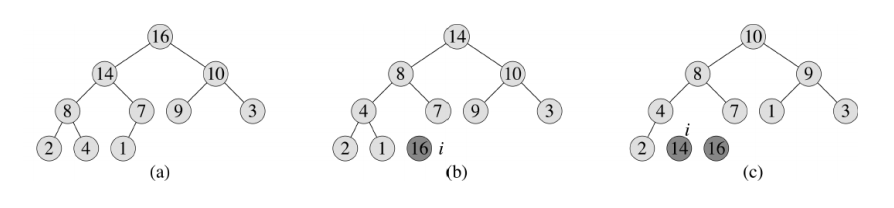
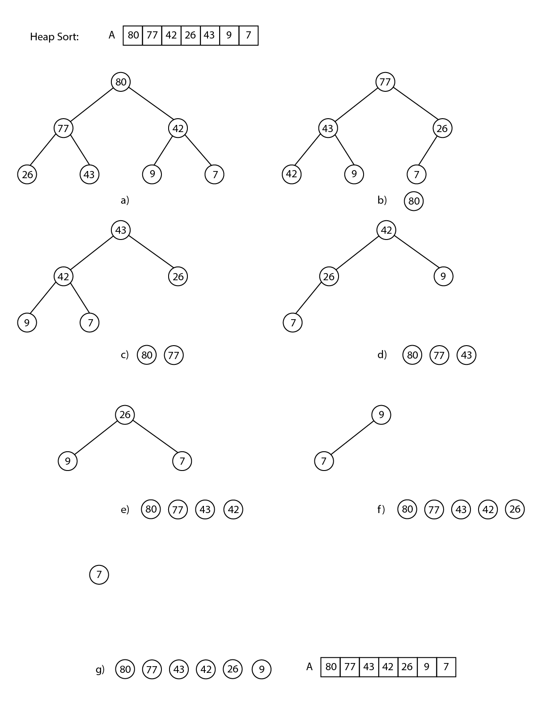

## N584 – Projeto e Análise de Algoritmos

### Prof. Napoleão Nepomuceno

#### AV1 - Trabalho de Projeto Análises de Algoritmos

##### Márcio Heleno **Matrícula: 1814038**

---

> Entrega do trabalho:
> Data da Entrega: 30/10/2019

**Questão 1** Questão 1 [2,0 pontos]. Utilizando uma árvore cujos nós representam as chamadas recursivas ao método QUICKSORT(A, p, r), abreviadamente QS(p, r), ilustre a execução do algoritmo para o vetor A = [78, 25, 62, 91, 13, 94, 50]. A raiz da árvore é a chamada QS(1,7). Para cada nó, o filho da esquerda representa a chamada a QS(p, q–1) e o filho da direita representa a chamada a QS(q+1, r). Explicite também o valor de q para cada nó da árvore.

**Questão 2** [2,0 pontos]. Ilustre a operação do HEAPSORT para o heap máximo A=[80, 77, 42, 26,
43, 9, 7]. Siga o modelo abaixo, que exibe o estado do heap ao final de cada iteração do for.

