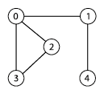

## N584 – Projeto e Análise de Algoritmos

### Prof. Napoleão Nepomuceno

#### AV3 - Lab03

##### Data do Laboratório: 27/10/2019

##### Márcio Heleno **Matrícula: 1814038**

---

> Entrega do trabalho:
> Data da Entrega: 01/12/2019 (enviar arquivo .odt)

### Exercício 1 - Av3 - 2

- **Passo 1:** Implementar o seguinte código em Java ou equivalente em outra linguagem de programação.

```Java
import java.util.Arrays;
import java.util.Collections;
import java.util.List;
import java.util.Random;
public class Exercicio1 {
	static class Grafo {
		public int[][] m;
		public Grafo(int size) {
			Random randomGenerator = new Random();
			m = new int[size][size];
			for (int i = 0; i < size; i++) {
				for (int j = i + 1; j < size; j++) {
					if (randomGenerator.nextDouble() <= 0.7) {
						m[i][j] = 1;
						m[j][i] = 1;
					}
				}
			}
			System.out.printf("Matriz de adjacências:\n");
			for (int i = 0; i < size; i++) {
				System.out.printf("--");
			}
			System.out.printf("\n");
			for (int i = 0; i < size; i++) {
				for (int j = 0; j < size; j++) {
					System.out.printf("%2d", m[i][j]);
				}
				System.out.printf("\n");
			}
			for (int i = 0; i < size; i++) {
				System.out.printf("--");
			}
			System.out.printf("\n\n");
		}
	}
	public static void main(String[] args) {
		int n = 5;
		Integer[] vertices = new Integer[n];
		System.out.printf("Vértices:\n");
		for (int i = 0; i < n; i++) {
			System.out.printf("--");
		}
		System.out.printf("\n");
		for (int i = 0; i < n; i++) {
			System.out.printf("%2d", i);
			vertices[i] = i;
		}
		System.out.printf("\n");
		for (int i = 0; i < n; i++) {
			System.out.printf("--");
		}
		System.out.printf("\n\n");
		Grafo g = new Grafo(n);
		List<Integer> candidata = Arrays.asList(vertices);
		Collections.shuffle(candidata);
		System.out.printf("Solução candidata:\n");
		for (int i = 0; i < n; i++) {
			System.out.printf("--");
		}
		System.out.printf("\n");
		for (int i = 0; i < n; i++) {
			System.out.printf("%2d", candidata.get(i));
		}
		System.out.printf("\n");
		for (int i = 0; i < n; i++) {
			System.out.printf("--");
		}
		System.out.printf("\n\n");

		if (viavel(g, candidata)) {
			System.out.println("É um ciclo hamiltoniano!");
		} else {
			System.out.println("Não é um ciclo hamiltoniano!");
		}

		if (hamiltoniano(g)) {
			System.out.println("Possui ciclo hamiltoniano!");
		} else {
			System.out.println("Não possui ciclo hamiltoniano!");
		}
	}
	static boolean viavel(Grafo g, List<Integer> candidata) {
		// todo - checar se todas as arestas da solucao candidata fazem parte do grafo
		return true;
	}
	static boolean hamiltoniano(Grafo g) {
		// todo - gerar todas as permutacoes dos vertices e checar se alguma é viável
		return true;
	}
}
```

**Passo 2:** O código gera um grafo de n vértices e uma matriz de adjacências criada de forma aleatória. Escreva a saída do seu programa e faça o desenho do grafo originado. (10%) Obs.1: Este passo deve ser realizado obrigatoriamente no laboratório.

```
Matriz de adjacências:
----------
 0 1 1 1 0
 1 0 0 0 1
 1 0 0 1 0
 1 0 1 0 0
 0 1 0 0 0
----------
```
<!-- Foto do Grafo aqui -->



**Passo 3:** Faça uma implementação para a função viavel que, dado o grafo e uma solução candidata, determina se a solução representa um ciclo hamiltoniano para o grafo. Apresente seu algoritmo. Escreva a saída do seu programa. (35%) Obs.1: Este passo deve ser realizado obrigatoriamente no laboratório.

```Java
static boolean viavel(Grafo g, List<Integer> candidata) {
  // todo - checar se todas as arestas da solucao candidata fazem parte do grafo

  for (int i = 0; i < g.m.length - 1 ;  i++) {
      if(g.m[candidata.get(i)][candidata.get(i+1)] == 0){
          return false;
      }
  }

  if(g.m[candidata.size()-1][candidata.get(0)] == 0){
      return false;
  }

  return true;
}
```

**Passo 4:** Realize a análise de complexidade da função viavel. (10%)
Obs.1: Este passo deve ser realizado obrigatoriamente no laboratório.

```java
                                                                        custo       vezes
static boolean viavel(Grafo g, List<Integer> candidata) {
  for (int i = 0; i < g.m.length - 1 ;  i++) {                          ->c1       (n)
      if(g.m[candidata.get(i)][candidata.get(i+1)] == 0){               ->c2       (n - 1)
          return false;                                                 ->c3       (n - 1)
      }
  }
  if(g.m[candidata.size()-1][candidata.get(0)] == 0){                   ->c4       (1)
      return false;                                                     ->c5       (1)
  }
  return true;                                                          ->c6       (1)
}
```
Somatorio de c1 + c2 + c3 + c4 + c5 + c6;

$T(n) = c1 + c2(n-1) + c3(n-1) + c4(1) + c5(1) + c6(1)$
$\Theta(n)$


**Passo 5:** Faça uma implementação para a função hamiltoniano que, dado o grafo, determina se este possui um ciclo hamiltoniano. Apresente seu algoritmo. Escreva a saída do seu programa. (35%)
Dica: Gerar todas as permutações possíveis dos vértices e checar se alguma é viável.

**Passo 6:**
O problema de determinar se um grafo possui um ciclo hamiltoniano pertence à classe NP? Justifique sua resposta. (10%)

Sim, Pois trata de um problema de descisão, pela discurção do algoritmo ele pode ser facilmente convertido em um algoritmo de tempo polinominal.
