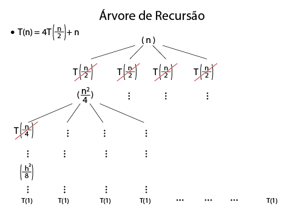

## N584 – Projeto e Análise de Algoritmos
### Prof. Napoleão Nepomuceno
#### AV1 - Trabalho de Projeto Análises de Algoritmos
##### Márcio Heleno **Matrícula: 1814038**

---

> Entrega do trabalho:
Data da Entrega: 11/09/2019

**Questão 1** [2,0 pontos]. Suponha que dois algoritmos, A e B, resolvem um mesmo problema. Assuma ainda que o tamanho das instâncias do problema é dado por um parâmetro n. Para cada item abaixo, assumindo-se n suficientemente grande, indique se A é mais rápido que B, se B é mais rápido que A, ou se não podemos inferir qual dos dois algoritmos é mais rápido. Justifique cada item.

a. O algoritmo A consome tempo $O(n^2)$ e o B consome tempo $\Theta(n^4)$.

O algoritmo *"A"* e mais rápido pois ele consume $O(n^2)$ no máximo ele e quadratico, enquanto que o *"B"* é um polinomial de 4 Grau.

b. O algoritmo A consome tempo $\Omega(n)$ e o B consome tempo $\Theta(n^2)$.

**Resposta errada.**
O algoritmo *"A"* e mais rápido pois ele consume $\Omega(n)$ no máximo ele e linear, enquanto que o *"B"* é quadratico.

**Resposta certa.**
Não podemos inferi pois o algoritmo *A* pode ter uma complexidade inferior a quadratico

c. O algoritmo A consome tempo $O(n^2)$ para instâncias de pior caso e o B consome tempo $\Omega(n^3)$ para instâncias de melhor caso.

**Resposta errada.**
Nesse caso não dar para saber pois se trata de comparação extrema melhor caso e pior caso são grandeza opostas.

**Resposta certa.**
O algoritmo *A* e mais rápido pois no máximo ele será $On^2$ e o B não e menor que $n^3$

d. O algoritmo A consome tempo $\Omega(n^4)$ para instâncias de pior caso e o B consome $O(n^3)$ para instâncias de pior caso.

**Resposta errada.**
O algoritmo *B* e mais rápido que o *A*, pois o algoritmo *A* no seu melhor caso e *polinomial* $n^4$, ja o *B* por sua vez e polinomial de grau 3.

Nesse caso em questão não podemos afirma, a menos na instancia de pior caso, o *A* e mais rápido na instancia de pior caso, nas demais instancias não podemos inferir.

**Questão 2** [2,0 pontos]. Aplique o método mestre para resolver as seguintes recorrências.

**(a)** $T(n) = 4T(n/4) + n$

$T(n) = aT(\frac{n}{b}) + f(n)$ $\Rightarrow$ $T(n) = 4T(\frac{n}{4}) + n$

1. passo:
  a = 4, b = 4 e $f(n) = n$
2. passo:
  $n^{\log_b a} = n^{\log_4 4} = n^1 = n$
  $f(n) = n = \Theta(n) = \Theta(n^{\log_4 4})$
3. passo:
  Pelo caso 2, $T(n) = \Theta(n \log n)$

**(b)** $T(n) = 1T(n/3) + n$

$T(n) = aT(\frac{n}{b}) + f(n)$ $\Rightarrow$ $T(n) = 1T(n/3) + n$

1. passo:
  a = 1, b = 3 e $f(n) = n$
2. passo:
  $n^{\log_b a} = n^{\log_3 1} = n^0 = 1$
  $f(n) = n = \Theta(1) = \Omega(n^{\log_3 1 + \epsilon})$
  $a f(\frac{n}{b})$ = $1 f(\frac{n}{3})$
  $af(\frac{n}{b})$ $\leq cf(n)$  $\exists c \leq 1$
  $1(\frac{n}{3})$ $\leq c(n)$ $\exists c \leq 1$
  $c$ $\geq (\frac{1}{3})$ $\exists c \leq 1$

1. passo:
  Pelo caso 3, $T(n) = \Theta(n)$

**(c)** $T(n) = 9T(n/3) + n$

$T(n) = aT(\frac{n}{b}) + f(n)$ $\Rightarrow$ $T(n) = 9T(n/3) + n$

1. passo:
  a = 9, b = 3 e $f(n) = n$
2. passo:
  $n^{\log_b a} = n^{\log_3 9} = n^2$
  $f(n) = n = O(n^{\log_b a - \epsilon}) = O(n^{\log_3 9 - \epsilon})$
3. passo:
  Pelo caso 1, $T(n) = \Theta(n^2)$

**(d)** $T(n) = 2T(n/2) + n^2$

$T(n) = aT(\frac{n}{b}) + f(n)$ $\Rightarrow$ $T(n) = 2T(n/2) + n^2$

1. passo:
  a = 2, b = 2 e $f(n) = n^2$
2. passo:
  $n^{\log_b a} = n^{\log_2 2} = n$
  $f(n) = n^2 = \Theta(n) = \Omega(n^{\log_b a + \epsilon}) = \Omega(n^{\log_2 2 + \epsilon})$
  $a f(\frac{n}{b})$ $\leq c f(n)$ se $ \exists c < 1$
  $2 f(\frac{n}{2})$ $\leq c f(n^2)$ se $ \exists c < 1$
  $2 (\frac{n^4}{2})$ $\leq c n^2 $ se $ \exists c < 1$
  $\frac{1}{2}$ $\leq c $ se $ \exists c < 1$
3. passo:
  Pelo caso 3, $T(n) = \Theta(n^2)$

**Questão 3** [2,0 pontos]. Utilize uma árvore de recursão para determinar o limite assintótico estrito (notação $\Theta$) para a equação de recorrência $T(n) = 4T(\frac{n}{2}) + n$.




| nivel    |          tam          |    #nos     |      #custo no      |      #custo nivel      |
| :------- | :-------------------: | :---------: | :-----------------: | :--------------------: |
| 0        |    $\frac{n}{2^0}$    |    $4^0$    |   $\frac{n}{2^0}$   |   $(\frac{1}{2})^0n$   |
| 1        |    $\frac{n}{2^1}$    |    $4^1$    |   $\frac{n}{2^1}$   |   $(\frac{1}{2})^1n$   |
| 2        |    $\frac{n}{2^2}$    |    $4^2$    |   $\frac{n}{2^2}$   |   $(\frac{1}{2})^2n$   |
| $\vdots$ |       $\vdots$        |  $\vdots$   |      $\vdots$       |        $\vdots$        |
| $h-1$    |  $\frac{n}{2^{h-1}}$  |  $4^{h-1}$  | $\frac{n}{2^{h-1}}$ | $(\frac{1}{2})^{h-1}n$ |
| $h$      | $\frac{n}{2^{h}} = 1$ | $4^h = N^2$ |     $\Theta(1)$     |     $\Theta(n^2)$      |

$\Rightarrow$ $ log_2 2^h = log_c N$ $\Rightarrow$ $h = log_2 N$

$\Rightarrow$ Custo do nível e o somatorio: $T(n) = \displaystyle\sum_{i=0}^{h-1} (\frac{n}{2})^0n + \Theta(n)$

$\Rightarrow T(n) \leq \displaystyle\sum_{i=0}^{\infty} (\frac{1}{2})^0n + \Theta(n)$

$\Rightarrow T(n) \leq \frac{1}{\frac{1 - 1}{2}}n + \Theta(n)$

$\Rightarrow T(n) = O(n)$

$\Rightarrow$ Custo do nível $\frac{1}{2}^0 n$ e $T(n) = O(n) \Rightarrow T(n) = \Theta(n^2)$

**Faltou**

**Questão 4** [2,0 pontos]. Seja um vetor A de n elementos inteiros e positivos. É possível determinar a quantidade de elementos ímpares do vetor em $O(n)$, percorrendo-se os elementos do vetor de forma iterativa.

Alternativamente, pode-se utilizar um método de divisão-e-conquista. Faça uma função para determinar a quantidade de elementos ímpares do vetor. O algoritmo deve recursivamente dividir o vetor em duas partes de tamanhos aproximadamente iguais até se chegar a um caso trivial.

Determine e resolva a equação de recorrência para o seu algoritmo.

O algoritmo recursivo é assintoticamente mais eficiente do que o algoritmo iterativo? Obs: para encontrar o ponto médio, utilize $m = (i + f)/2$, onde i e f são, respectivamente, os índices inicial e final do subvetor.

* Interativo

```java
int vet1[] = new int[10];
int qtdImpar = 0;
for (int i = 0; i < vet1.length; i++) {
  if (i % 2 != 0) {
      System.out.println("é impar");
      qtdImpar++;
  } else {
      System.out.println("é par");
  }
}
```

* Recursivo

```java
public static int VetImpar(int[] a, int inicio, int fim) {
  if (inicio == fim) {
    // apenas um elemento, retorna ele proprio
    return a[inicio];
  } else {
    // Meu problema ainda pode ser dividido em pedaços menores
    int meio = (inicio + fim) / 2;
    int v1 = VetImpar(a, inicio, meio);
    int v2 = VetImpar(a, meio + 1, fim);

    if (v1 % 2 != 0) {
        System.out.println(v1);
    }

    if (v2 % 2 != 0) {
        System.out.println(v2);
    }
    return 0;
  }
```

```pseudoCodigo
VetImpar(int[] a, int inicio, int fim) {
  if (inicio == fim) {
    return a[inicio]
  } else {
    // Meu problema ainda pode ser dividido em pedaços menores
    int meio = (inicio + fim) / 2
    int v1 = VetImpar(a, inicio, meio)
    int v2 = VetImpar(a, meio + 1, fim)

    return v1 + v2
  }
```

$\Rightarrow T(n) = 2T(\frac{n}{2}) + c$

$T(n) = aT(\frac{n}{b}) + f(n)$ $\Rightarrow T(n) = 2T(\frac{n}{2}) + c$

1. passo:
  a = 2, b = 2 e $f(n) = c$
2. passo:
  $n^{\log_b a} = n^{\log_2 2} = n$
  $f(n) = c \leq \Theta(n) = \Theta(n^{\log_2 2}) = \Theta(n)$
  $f(n) = n \leq \Theta(1) = \Omega(n^{\log_3 1 - \epsilon})$
3. passo:
  Pelo caso 1, $T(n) = \Theta(n)$

**Questão 5** [2,0 pontos]. Determine um limite assintótico estrito (notação $\Theta$) do custo computacional da função abaixo. Indique qual o seu valor de retorno em função do parâmetro n?

```
int funcao(n)                     tempo
    sum = 0                        c1
    for i = 1 to n                 c2
        for j = i to n*n           c3
            for k = 1 to 2         c4
                sum = sum + 10     c5
    return sum                     c6
```

| tempo |            # vezes            |         custo |
| :---- | :---------------------------: | ------------: |
| c1    |               1               |             c |
| c2    |            $(n+1)$            |             n |
| c3    | $\frac{[(n^2+1)+(n^2)]*n}{2}$ | $\Theta(n^2)$ |
| c4    | $\frac{((3n^2) + 3n)*n^2}{2}$ | $\Theta(n^3)$ |
| c5    |           $(n^3+2)$           | $\Theta(n^3)$ |
| c6    |               1               |             c |

Resultado: $T(n) = \Theta(n^4)$

> Obs:
> Interações: (numero_final - numero_inicial) + 1
> Teste = #interar + 1

> Obs:
> $x = \frac{[(n^2+1) + (n^2-n+2)] + n}{2}$ = $\Theta(n^3)$
> $y = \frac{[n^2 + (n^2-n+1)]+n}{2}$
